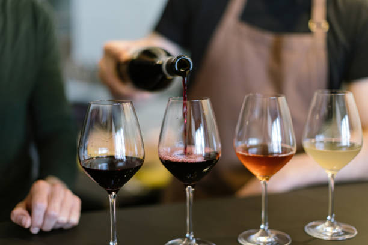
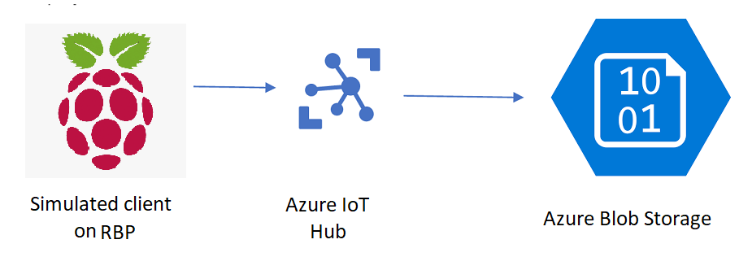

# **FlavorSense: Interactive Tasting Experience System**  

### **Enhancing Wine and Food Tastings with Smart Ambient Control**

---

**FlavorSense** is an innovative system that revolutionizes wine and food tastings by creating an interactive and immersive environment. By seamlessly integrating hardware, software, and cloud-based intelligence, FlavorSense tailors lighting, temperature, and music to enhance the tasting experience based on the selected product.  

In this project we want to establish a bidirectional connection between a Raspberry Pi SenseHat and Azure IoT Hub. Azure Blob Storage has been used also to storage the information given by the sensors in the Raspberry.

We can see the intended architecture below:

**Key Features:**
- **Real-Time Sensing**: Monitors ambient conditions like temperature and light intensity.  
- **Customizable Experience**: Allows users to select tasting preferences via a joystick interface.  
- **Dynamic Ambient Adjustments**: Automatically controls lighting, temperature, and music for an optimal atmosphere.  
- **Cloud Integration**: Leverages Azure for data storage, visualization, and automation workflows.  

Discover how **FlavorSense** blends technology and taste to create memorable sensory experiences!

## Credits 

This project includes code from [Original Repository](https://github.com/iiot-cloud-icai/Azure_IoT_Lab), developed by [SeryioGonzalez](https://github.com/SeryioGonzalez).

### **Contributors**
This project is a collaborative effort by a dedicated team of innovators:  

- **Sofia Amores Parra** - @sofiaamores (https://www.github.com/sofiaamores)
- **Claudia Coduras Gracia** - @claucoduras (https://www.github.com/claucoduras)
- **Iván Júdez Ráfales** - @Mrchuki (https://www.github.com/Mrchuki)
- **Jon Toledo Bengoechea** -

---

